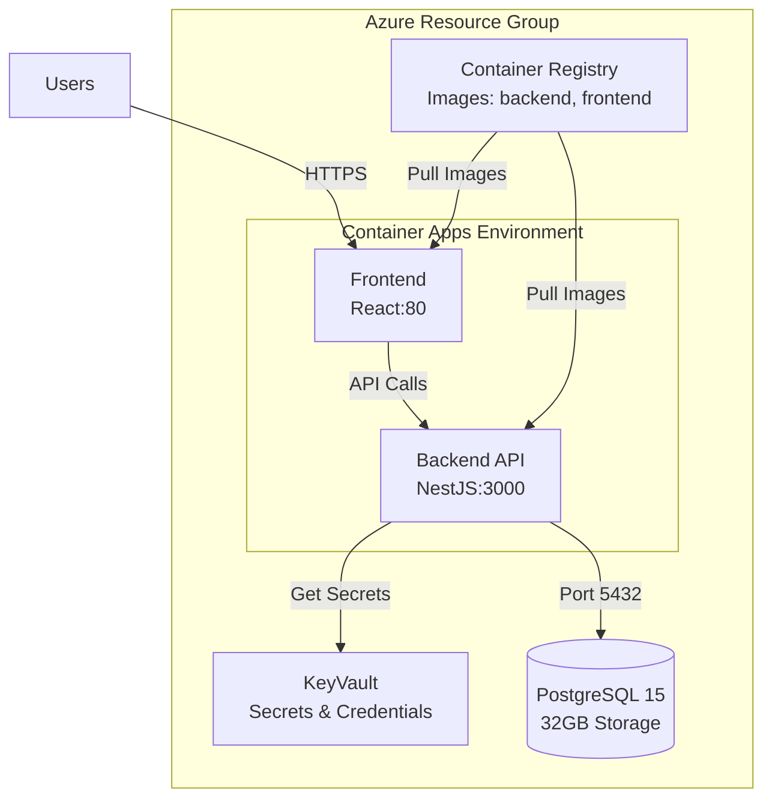

# USAsset Azure Complete Operations Guide

## Table of Contents
1. [Quick Reference](#quick-reference)
2. [Architecture Overview](#architecture-overview)
3. [Initial Deployment](#initial-deployment)
4. [Development Workflow](#development-workflow)
5. [Update Procedures](#update-procedures)
6. [Disaster Recovery](#disaster-recovery)
7. [Security & Hardening](#security-hardening)
8. [Troubleshooting](#troubleshooting)
9. [Cost Management](#cost-management)

---

## Quick Reference

### Resource Information
```yaml
Resource Group: useng-usasset-api-rg
Location: East US
Subscription: Azure-CSP-Sandbox

Resources:
  ACR: usassetacryf2eqktewmxp2
  Database: usasset-db-yf2eqktewmxp2-v2
  KeyVault: usasset-kv-yf2eqktewmxp2
  Environment: usasset-env-yf2eqktewmxp2
  Backend App: usasset-backend
  Frontend App: usasset-frontend

URLs:
  Backend: https://usasset-backend.purpledune-aecc1021.eastus.azurecontainerapps.io
  Frontend: https://usasset-frontend.purpledune-aecc1021.eastus.azurecontainerapps.io
```

### Quick Update Commands
```bash
# Update backend
az acr build --registry usassetacryf2eqktewmxp2 --image backend:latest apps/backend/
az containerapp revision restart --name usasset-backend --resource-group useng-usasset-api-rg

# Update frontend
az acr build --registry usassetacryf2eqktewmxp2 --image frontend:latest apps/frontend/
az containerapp revision restart --name usasset-frontend --resource-group useng-usasset-api-rg
```

---

## Architecture Overview



### Technology Stack
- **Backend**: NestJS, Prisma ORM, Node.js 20
- **Frontend**: React, Vite, nginx
- **Database**: PostgreSQL 15 Flexible Server
- **Container**: Docker, Azure Container Apps
- **CI/CD**: Azure Container Registry builds

---

## Initial Deployment

### Prerequisites Checklist
- [x] Azure CLI installed and authenticated (`az login`)
- [x] Resource group created: `useng-usasset-api-rg`
- [x] Node.js 20+ installed locally
- [x] Docker Desktop (optional for local testing)

### Phase 1: Infrastructure Setup
```bash
# Deploy infrastructure (ACR, DB, KeyVault, Environment)
az deployment group create \
  --resource-group useng-usasset-api-rg \
  --name infrastructure \
  --template-file infra/infrastructure.bicep \
  --parameters dbAdminPassword="$(openssl rand -base64 32)"
```

### Phase 2: Build & Push Images
```bash
# Build images in Azure Container Registry
az acr build --registry usassetacryf2eqktewmxp2 --image backend:latest apps/backend/
az acr build --registry usassetacryf2eqktewmxp2 --image frontend:latest apps/frontend/
```

### Phase 3: Deploy Applications
```bash
# Deploy container apps
az deployment group create \
  --resource-group useng-usasset-api-rg \
  --name applications \
  --template-file infra/simple-deploy.bicep \
  --parameters acrName=usassetacryf2eqktewmxp2 \
    dbServerName=usasset-db-yf2eqktewmxp2-v2 \
    containerEnvName=usasset-env-yf2eqktewmxp2 \
    dbPassword="<secure-password>"
```

### Post-Deployment Configuration

#### 1. KeyVault Access & Secrets
```bash
# Grant yourself KeyVault access
CURRENT_USER=$(az ad signed-in-user show --query id -o tsv)
az keyvault set-policy --name usasset-kv-yf2eqktewmxp2 \
  --object-id $CURRENT_USER \
  --secret-permissions get list set delete

# Store essential secrets
az keyvault secret set --vault-name usasset-kv-yf2eqktewmxp2 --name db-admin-password --value "<password>"
az keyvault secret set --vault-name usasset-kv-yf2eqktewmxp2 --name database-connection-string --value "<connection>"
az keyvault secret set --vault-name usasset-kv-yf2eqktewmxp2 --name acr-password --value "<acr-password>"
az keyvault secret set --vault-name usasset-kv-yf2eqktewmxp2 --name backend-url --value "<backend-url>"
az keyvault secret set --vault-name usasset-kv-yf2eqktewmxp2 --name frontend-url --value "<frontend-url>"
```

#### 2. Database Firewall
```bash
# Add your IP for development access
MY_IP=$(curl -s https://ifconfig.me)
az postgres flexible-server firewall-rule create \
  --resource-group useng-usasset-api-rg \
  --name usasset-db-yf2eqktewmxp2-v2 \
  --rule-name AllowMyIP \
  --start-ip-address $MY_IP \
  --end-ip-address $MY_IP
```

---

## Development Workflow

### Local Development Setup
```bash
# Backend
cd apps/backend
npm install
npm run start:dev  # http://localhost:3000

# Frontend
cd apps/frontend
npm install
npm run dev        # http://localhost:5173
```

### Database Migrations
```bash
# Create migration
cd apps/backend
npx prisma migrate dev --name describe_change

# Deploy to Azure
DATABASE_URL=$(az keyvault secret show \
  --vault-name usasset-kv-yf2eqktewmxp2 \
  --name database-connection-string \
  --query value -o tsv)
DATABASE_URL=$CONNECTION npx prisma migrate deploy
```

---

## Update Procedures

### Standard Code Updates (Most Common)

#### Backend Update
```bash
# Single command deployment
az acr build --registry usassetacryf2eqktewmxp2 --image backend:latest apps/backend/

# Wait for build to complete, then restart
az containerapp revision restart --name usasset-backend --resource-group useng-usasset-api-rg
```

#### Frontend Update
```bash
# Single command deployment
az acr build --registry usassetacryf2eqktewmxp2 --image frontend:latest apps/frontend/

# Wait for build to complete, then restart
az containerapp revision restart --name usasset-frontend --resource-group useng-usasset-api-rg
```

### Environment Variable Updates
```bash
# Add or update environment variables without rebuild
az containerapp update \
  --name usasset-backend \
  --resource-group useng-usasset-api-rg \
  --set-env-vars "NEW_VAR=value" "ANOTHER_VAR=value2"
```

### Rollback Procedures
```bash
# List all revisions
az containerapp revision list \
  --name usasset-backend \
  --resource-group useng-usasset-api-rg \
  --query "[].{name:name, created:properties.createdTime, active:properties.active}" -o table

# Activate previous revision
az containerapp revision activate \
  --name usasset-backend \
  --resource-group useng-usasset-api-rg \
  --revision <previous-revision-name>
```

---

## Disaster Recovery

### Backup Procedures

#### Database Backup
```bash
# Automated backups are configured for 7 days
# Manual backup
az postgres flexible-server backup create \
  --resource-group useng-usasset-api-rg \
  --name usasset-db-yf2eqktewmxp2-v2 \
  --backup-name manual-backup-$(date +%Y%m%d)
```

#### Export KeyVault Secrets
```bash
# Backup all secrets
for secret in $(az keyvault secret list --vault-name usasset-kv-yf2eqktewmxp2 --query "[].name" -o tsv); do
  az keyvault secret show --vault-name usasset-kv-yf2eqktewmxp2 --name $secret > backup-$secret.json
done
```

### Recovery Procedures

#### Stuck Resource Recovery
When PostgreSQL gets stuck in "Dropping" state:
1. Wait 10-15 minutes for automatic cleanup
2. If persists, create new resource with different name (append -v2, -v3)
3. Update bicep templates with new resource name
4. Redeploy

#### Complete Environment Recovery
```bash
# 1. Verify resource group exists
az group show --name useng-usasset-api-rg

# 2. Deploy infrastructure
./deploy.sh

# 3. Restore database from backup
az postgres flexible-server restore \
  --resource-group useng-usasset-api-rg \
  --name usasset-db-restored \
  --source-server usasset-db-yf2eqktewmxp2-v2 \
  --restore-time "2025-08-27T10:00:00Z"

# 4. Update connection strings and redeploy apps
```

---

## Security & Hardening

### Current Security Measures
- ✅ Database SSL enforced
- ✅ Secrets in KeyVault
- ✅ ACR authentication required
- ✅ HTTPS only endpoints
- ✅ Database firewall configured

### Recommended Enhancements (Simple)

#### 1. Enable Container App Authentication
```bash
az containerapp auth update \
  --name usasset-backend \
  --resource-group useng-usasset-api-rg \
  --enabled true \
  --action AllowAnonymous
```

#### 2. Configure CORS Properly
```typescript
// apps/backend/src/main.ts
app.enableCors({
  origin: process.env.FRONTEND_URL || 'https://usasset-frontend.purpledune-aecc1021.eastus.azurecontainerapps.io',
  credentials: true,
  methods: ['GET', 'POST', 'PUT', 'DELETE'],
  allowedHeaders: ['Content-Type', 'Authorization']
});
```

#### 3. Add Health Checks
```typescript
// apps/backend/src/app.controller.ts
@Get('health')
getHealth() {
  return { 
    status: 'ok', 
    timestamp: new Date().toISOString(),
    service: 'usasset-backend'
  };
}
```

#### 4. Resource Limits
```bash
# Set memory and CPU limits
az containerapp update \
  --name usasset-backend \
  --resource-group useng-usasset-api-rg \
  --cpu 0.5 --memory 1Gi
```

---

## Troubleshooting

### Common Issues & Solutions

#### Container Won't Start
```bash
# Check logs
az containerapp logs show \
  --name usasset-backend \
  --resource-group useng-usasset-api-rg \
  --tail 100

# Common causes:
# - Missing environment variables
# - Database connection failed
# - Image pull authentication failed
```

#### Database Connection Issues
```bash
# Verify connection string
az containerapp show \
  --name usasset-backend \
  --resource-group useng-usasset-api-rg \
  --query "properties.template.containers[0].env"

# Test from local machine
psql "postgresql://dbadmin:<password>@usasset-db-yf2eqktewmxp2-v2.postgres.database.azure.com:5432/usasset?sslmode=require"
```

#### Image Pull Errors
```bash
# Verify image exists
az acr repository show-tags \
  --name usassetacryf2eqktewmxp2 \
  --repository backend

# Check ACR authentication
az containerapp show \
  --name usasset-backend \
  --resource-group useng-usasset-api-rg \
  --query "properties.configuration.registries"
```

### Monitoring & Logs

#### Stream Live Logs
```bash
az containerapp logs show \
  --name usasset-backend \
  --resource-group useng-usasset-api-rg \
  --follow
```

#### Check Application Status
```bash
# Quick health check
curl https://usasset-backend.purpledune-aecc1021.eastus.azurecontainerapps.io/health

# Container status
az containerapp show \
  --name usasset-backend \
  --resource-group useng-usasset-api-rg \
  --query "properties.runningStatus"
```

---

## Cost Management

### Current Configuration (Development/Testing)
- **PostgreSQL**: B1ms (Burstable) - ~$12/month
- **Container Apps**: Consumption plan - ~$20-40/month
- **ACR**: Basic tier - ~$5/month
- **KeyVault**: Standard - ~$0.03/10k operations
- **Total Estimate**: ~$40-60/month

### Cost Optimization Strategies

#### 1. Scale Down During Off-Hours
```bash
# Create schedule for scaling
# Night: Scale to 0
az containerapp update \
  --name usasset-backend \
  --resource-group useng-usasset-api-rg \
  --min-replicas 0 --max-replicas 1

# Day: Scale up
az containerapp update \
  --name usasset-backend \
  --resource-group useng-usasset-api-rg \
  --min-replicas 1 --max-replicas 3
```

#### 2. Use Dev/Test Pricing
- Apply for Azure Dev/Test subscription for 40-60% discount
- Use B-series VMs for non-production workloads

#### 3. Clean Up Unused Resources
```bash
# List all resources with costs
az consumption usage list \
  --start-date 2025-08-01 \
  --end-date 2025-08-31 \
  --query "[?contains(resourceGroup, 'useng-usasset')].{name:instanceName, cost:pretaxCost}" \
  -o table
```

---

## Appendix

### File Structure
```
USAsset3/
├── apps/
│   ├── backend/          # NestJS API
│   │   ├── Dockerfile
│   │   ├── prisma/       # Database schema
│   │   └── src/          # Source code
│   └── frontend/         # React app
│       ├── Dockerfile
│       └── src/          # Source code
├── infra/
│   ├── infrastructure.bicep    # Core Azure resources
│   ├── simple-deploy.bicep     # Container apps
│   └── database-only.bicep     # Database deployment
├── docs/
│   └── AZURE-COMPLETE-GUIDE.md # This document
└── deploy.sh                    # Deployment script
```

### Bicep Template Reference
- **infrastructure.bicep**: Creates ACR, KeyVault, Database, Container Environment
- **simple-deploy.bicep**: Deploys container apps with authentication
- **database-only.bicep**: Standalone database deployment (recovery)

### Environment Variables

#### Backend Required
```env
DATABASE_URL=postgresql://...
NODE_ENV=production
PORT=3000
```

#### Frontend Required
```env
VITE_API_URL=https://usasset-backend.purpledune-aecc1021.eastus.azurecontainerapps.io
```

### Team Contacts
- **Azure Admin**: Configure in CLAUDE.md
- **Database Access**: Request from KeyVault owner
- **Emergency Contact**: Update as needed

---

## Version History
- **v1.0.0** (2025-08-27): Initial consolidated guide
  - Combined all SOPs into single document
  - Added metadata headers
  - Included architecture diagrams
  - Added cost management section

---

## Notes
- All passwords are stored in KeyVault
- Database has 7-day automatic backup retention
- Container Apps auto-scale based on HTTP traffic
- ACR basic tier sufficient for team < 10 developers
- Monitor Azure costs weekly to avoid surprises

---

*End of Document*